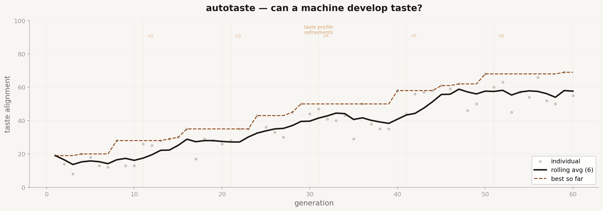

# autotaste



*Taste used to be the thing that couldn't be taught. You either had it or you didn't. Decades of design education tried to formalize it into principles, grids, color theory, Gestalt laws. But everyone knew those were just the scaffolding. The real thing, the ability to look at something and know it's right before you can explain why, that lived somewhere deeper. Somewhere we couldn't reach with rules. This repo asks a simple question: can a machine develop taste? Not follow instructions. Not optimize a metric. Develop a sensibility. Look at things you admire, make things that feel like them, and then tell you what it learned about why they work.*

The idea: drop reference images into a folder. Screenshots of interfaces, designs, layouts, anything you admire. The agent studies them, extracts what makes them work, then generates original designs that close the gap between what it makes and what you showed it. No spec. No scoring rubric. Just references and a blank canvas.

The output is two things: the final design AND a learned taste profile. A distilled set of design principles the agent extracted from your references. Not rules you told it. Rules it figured out by looking.

You don't tell the machine what good looks like. You show it. Then you find out what it sees.

## How it works

Five files that matter:

- **`references/`** — drop your images here. Screenshots, photos of interfaces, design work you admire. PNG or JPG. This is the only input. No spec, no brief, no instructions. Just images.
- **`study.py`** — the agent studies your references using a vision model. Extracts patterns, principles, and a taste profile. This runs once before the evolution loop.
- **`generate.py`** — produces a single `design.html` file guided by the taste profile. Also handles mutations using critiques from previous generations.
- **`score.py`** — the taste judge. A vision model compares each generation's screenshot against the original references. Not "does it match the spec" but "does it feel like it belongs in the same collection." Returns a taste alignment score and a critique.
- **`evolve.py`** — the loop. Study → generate → screenshot → score → keep or discard → mutate → repeat. The taste profile refines itself across generations as the agent learns what closes the gap and what doesn't.

Every generation gets saved to `/history` with its HTML, screenshots, score, and the evolving taste profile.

## This is not style transfer

Style transfer copies surface-level patterns. Colors, textures, shapes. Autotaste tries to go deeper. It's asking: what design decisions made these references feel the way they do? Is it the whitespace ratio? The type scale? The way interactive elements recede and content advances? The restraint in the color palette? The rhythm of the vertical spacing?

The taste profile the agent builds isn't "use these colors and fonts." It's "here's what I think you value about design, based on what you showed me."

Sometimes it's wrong. That's the interesting part.

## Quick start

**Requirements:** Python 3.10+, [uv](https://docs.astral.sh/uv/), an Anthropic API key, Playwright (for screenshots).

```bash
# 1. Install uv
curl -LsSf https://astral.sh/uv/install.sh | sh

# 2. Install dependencies
uv sync

# 3. Install Playwright browsers
uv run playwright install chromium

# 4. Set your API key
export ANTHROPIC_API_KEY=sk-ant-...

# 5. Drop 3-10 reference images into the references/ folder
# Screenshots of interfaces, designs, layouts you admire.
# More images = more signal. But 5 good ones beats 20 random ones.

# 6. Study the references (builds the initial taste profile)
uv run study.py

# 7. Run a single generation to test
uv run generate.py

# 8. Run the evolution loop
uv run evolve.py
```

## What the agent produces

Each generation outputs:

| Artifact | Format | What it is |
|----------|--------|------------|
| Design | `design.html` | A self-contained HTML/CSS page. The agent decides what to make based on the references. |
| Desktop screenshot | PNG | 1440×900 capture |
| Mobile screenshot | PNG | 375×812 capture |
| Taste delta | JSON | What the agent learned this generation. What moved the score. What didn't. |

The agent decides what kind of interface to create based on what it sees in your references. If you feed it landing pages, it makes landing pages. If you feed it dashboards, it makes dashboards. If you feed it a mix, it tries to find the thread that connects them.

## The taste profile

After studying your references, the agent produces a `taste_profile.json`. This is the most interesting artifact in the entire repo. It looks something like:

```json
{
  "principles": [
    "Whitespace is used as a structural element, not as leftover space",
    "Typography carries 80% of the visual hierarchy. Color is secondary",
    "Interactive elements recede visually. Content advances",
    "The color palette is derived from natural materials: paper, stone, ink",
    "Vertical rhythm follows a consistent baseline. Nothing floats randomly"
  ],
  "patterns": {
    "spacing": "Generous. Minimum 24px between elements. Sections separated by 48-64px",
    "typography": "Serif for editorial content. Sans-serif for UI. Never decorative",
    "color": "Warm neutrals dominate. One accent color, used sparingly for interaction",
    "layout": "Single-column preferred. Max-width constrained. Centered",
    "interaction": "Subtle. No flashy animations. State changes feel physical, not digital"
  },
  "anti_patterns": [
    "Gradient backgrounds",
    "More than two font families",
    "Color used for decoration rather than function",
    "Tight spacing between unrelated elements",
    "Drop shadows used for style rather than elevation hierarchy"
  ],
  "mood": "Calm confidence. Editorial restraint. The feeling of a well-organized desk.",
  "confidence": 0.72
}
```

This profile evolves. After generation 30, the principles might sharpen or shift based on what the agent discovers actually closes the gap between its output and your references. The `confidence` score reflects how consistent the references are. High confidence means your references share a clear sensibility. Low confidence means the agent is finding contradictions.

## Scoring

The scoring model doesn't use a rubric. It uses comparison.

It receives:
1. The original reference images
2. The current generation's screenshots
3. The current taste profile

It answers one question: **Does this design feel like it belongs in the same collection as the references?**

Not "is it similar." Not "did it copy the layout." Does it share the same sensibility? Would you pin it on the same mood board?

The score (0-100) reflects taste alignment:
- **0-30**: Different universe. The agent hasn't found the thread yet.
- **30-50**: Surface similarities but the soul is different.
- **50-70**: Getting there. The principles are right but the execution is off.
- **70-85**: Belongs in the collection. A designer would recognize the kinship.
- **85-100**: Indistinguishable in sensibility. Rare. Might not be possible.

The critique explains what's closing the gap and what's widening it. This feedback drives the next generation.

## The history folder

```
history/
├── taste_profile_v1.json    # initial profile from study.py
├── taste_profile_v2.json    # refined after gen 10
├── taste_profile_v3.json    # refined after gen 25
├── taste_profile_final.json # end-of-run profile
├── gen_001/
│   ├── design.html
│   ├── desktop.png
│   ├── mobile.png
│   ├── score.json
│   ├── taste_delta.json     # what shifted this generation
│   └── meta.json
├── gen_002/
│   └── ...
├── ...
├── evolution.csv
├── best.json
└── summary.md
```

## Configuration

```python
# evolve.py
GENERATIONS = 300
KEEP_TOP_N = 3
SCORE_THRESHOLD = 15
TASTE_REFINE_EVERY = 10     # re-study references every N generations
MODEL = "claude-sonnet-4-20250514"
SCORE_MODEL = "claude-sonnet-4-20250514"
```

The `TASTE_REFINE_EVERY` setting is important. Every 10 generations, the agent goes back to the references with everything it's learned so far and rebuilds the taste profile. Early profiles are rough. Later profiles are sharp. Watching the profile evolve across the run is half the point.

## Interesting experiments to try

**Feed it contradictions.** Drop in a Muji product page and a brutalist portfolio. Watch the agent try to reconcile them. The taste profile it produces will reveal what it thinks they have in common. Sometimes it finds something you didn't see.

**Feed it your own work.** Drop in screenshots of things you've designed. The taste profile becomes a mirror. It tells you what your design sensibility actually is, not what you think it is.

**Feed it one image.** Minimum viable taste. Can the agent extrapolate a full sensibility from a single reference? The answer is surprisingly often yes, but the confidence score will be low and the results will be wild.

**Compare profiles.** Run autotaste twice with different reference sets. Compare the taste profiles. The diff between them is a map of your aesthetic range.

## Design philosophy

- **No spec. No brief. No instructions.** The only input is images. Everything else is discovered.
- **The profile is the product.** The generated designs are interesting but the taste profile is the real output. It's a machine-readable articulation of an aesthetic sensibility. That's never existed before.
- **Taste evolves.** The profile at generation 1 is a rough sketch. The profile at generation 100 is a refined theory. Watching it sharpen is watching a machine develop opinions.
- **Wrong is interesting.** When the agent misreads your references, the mistakes reveal what's hard to articulate about taste. The gaps in the profile are as informative as the principles.

## What this is not

This is not a design tool. It's a design experiment. The question "can a machine develop taste" doesn't have a clean answer. The answer depends on what you mean by taste, and running this forces you to think about that question more carefully than any essay could.

It's also not style transfer, not a mood board generator, and not a design system extractor. Those tools work from rules. This works from vibes. On purpose.

This is experimental. Built out of curiosity, for learning and education. Not a product, not a service. Just an idea I wanted to test in the open.

## License

MIT
